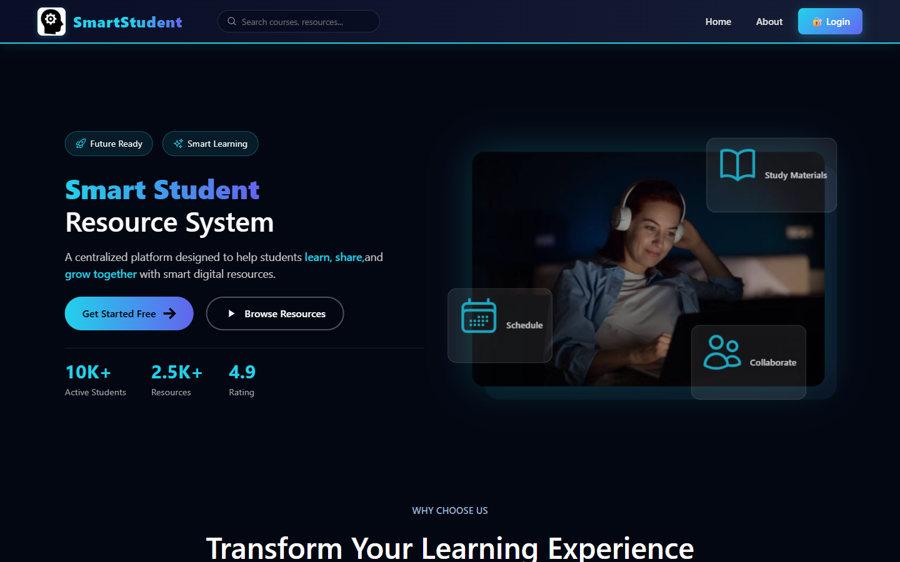
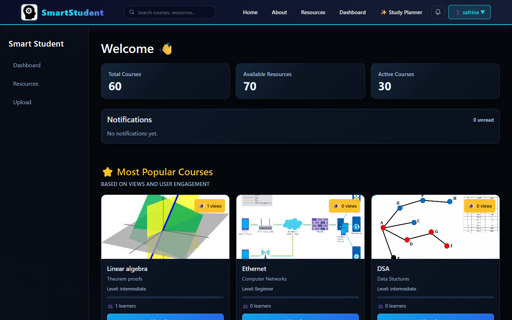
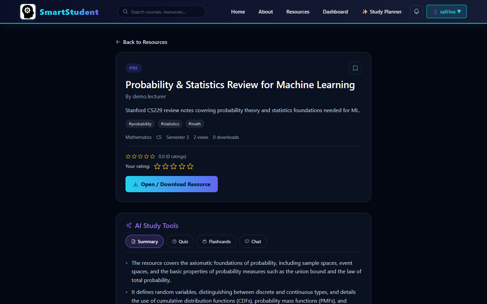
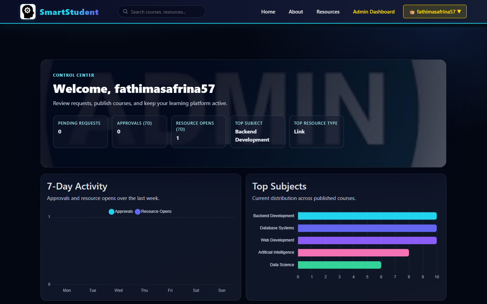
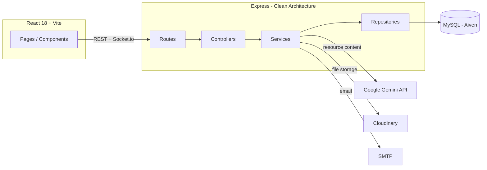

# SmartStudent — University Resource Management Platform

A full-stack platform where students discover and request learning resources, lecturers publish course material, moderators keep quality in check, and admins run the whole thing — with a real AI layer (Google Gemini) generating summaries, quizzes, flashcards, study plans, and grounded chat over the actual resource content.

**Live demo:** https://smart-student-resource-system.vercel.app
**Backend API:** https://smart-student-resource-system-production.up.railway.app

---

## Screenshots

| Homepage | Student Dashboard |
|---|---|
|  |  |

| AI Study Tools (grounded in the real PDF) | Admin Analytics |
|---|---|
|  |  |

---

## Try it yourself

| Role | Username / Email | Password |
|---|---|---|
| Student | `safrina` | `password123` |
| Lecturer | `demo.lecturer` | `Demo@12345` |
| Moderator | `demo.moderator` | `Demo@12345` |
| Admin | `fathimasafrina57@gmail.com` | `admin123` |

(Seeded demo accounts — not real credentials. There's also a working registration flow that auto-logs you in.)

---

## Features

**Core platform**
- Five distinct roles (student, lecturer, moderator, department admin, system admin) with role-specific dashboards and permissions
- Full auth lifecycle: registration with email verification, JWT sessions, password reset, profile management
- Resource hub: browse, comment (threaded), rate, bookmark, and download lecturer-approved resources
- Lecturer upload → moderator/admin review → publish pipeline, with a visible status timeline per request
- Global search across courses and resources
- Real-time notifications over Socket.io (request approved/rejected, etc.)
- Scheduled analytics reports emailed on a cron, plus an on-demand admin analytics dashboard (Chart.js)
- Achievements & activity history, computed live from real usage — nothing hardcoded

**AI features (Google Gemini)**
- **Resource Summary** — grounded in the actual PDF content when available, not just the title/description
- **Quiz Generator** and **Flashcard Generator** — structured output, cached per resource so repeat requests are instant
- **Chat with Resource** — answers only from the resource's real content; explicitly declines when the answer isn't there
- **AI Study Planner** — a week-by-week plan generated from the student's actual enrolled courses
- **Resource Recommendations** — grounded suggestions from the student's real engagement history (never invents a resource that doesn't exist)
- **AI Search Assist** — synthesizes a direct answer from real search results

---

## Architecture

The backend follows Clean Architecture end to end — every feature is layered the same way:

```
Route  →  Controller  →  Service  →  Repository  →  MySQL
 (thin,      (shapes        (business       (parameterized
 wires        request/       logic,          SQL, no logic)
 middleware)  response)      throws
                              AppError)
```

- **Routes** wire middleware (auth, validation) to a controller — no logic lives here
- **Controllers** extract request data, call the service, shape the response
- **Services** hold business logic and orchestration, throw a typed `AppError` on failure
- **Repositories** are the only layer that touches SQL — raw parameterized queries via a promise-wrapped pool
- **Validation** is zod-schema-driven, enforced by one generic middleware for every route



---

## Tech Stack

**Frontend:** React 18, React Router, Axios, Chart.js, Framer Motion, React Hook Form, React Icons, Socket.io-client
**Backend:** Node.js, Express, JWT, bcrypt, Multer, Nodemailer, Socket.io, Zod
**Database:** MySQL (Aiven, hosted)
**AI:** Google Gemini API (`@google/genai`), structured output + response caching
**File storage:** Cloudinary
**Deployment:** Vercel (frontend), Railway (backend), Aiven (MySQL)

---

## Getting Started (local development)

**Prerequisites:** Node.js 18+, MySQL 8+

```bash
git clone https://github.com/Safrina322/smart-student-resource-system.git
cd smart-student-resource-system

# Backend
cd backend
npm install
cp .env.example .env   # fill in your DB credentials, JWT secret, etc.
node index.js           # runs pending migrations and seeds demo accounts on first boot

# Frontend (new terminal)
cd frontend
npm install
npm run dev
```

The backend runs any pending database migrations automatically on boot — no
separate step needed for local dev. Schema changes live as versioned files in
`backend/migrations/` (see that folder's README for how to add one); `npm run
migrate` runs them standalone without starting the server, useful as an
explicit pre-deploy step. See `.env.example` for every environment variable
the app reads and what each one is for.

---

## API Overview

Interactive docs (Swagger UI, generated from the actual Zod validation
schemas): `/api/docs`. Raw OpenAPI JSON: `/api/openapi.json`.

All endpoints live under `/api`. Grouped by resource:

| Prefix | Covers |
|---|---|
| `/api/auth`, `/api/admin` | Registration, login, password reset, admin login |
| `/api/courses`, `/api/admin/courses` | Course catalog + admin course/lesson management |
| `/api/resource-hub` | Public resource browsing, comments, ratings, bookmarks |
| `/api/lecturer/resources` | Lecturer resource upload |
| `/api/requests`, `/api/admin/requests` | Student resource requests + admin review pipeline |
| `/api/moderation` | Moderator review queue |
| `/api/ai` | Summary, quiz, flashcards, chat, study planner, recommendations, search assist |
| `/api/analytics`, `/api/admin/analytics` | Event tracking + admin analytics/reports |
| `/api/search` | Global search |
| `/api/notifications` | Real-time notification inbox |
| `/api/achievements` | Badge progress + activity history |
| `/api/admin/audit` | Admin action audit log |

---

## Project Structure

```
backend/
  routes/         # thin route definitions
  controllers/     # request/response shaping
  services/        # business logic
  repositories/     # SQL access
  validation/       # zod schemas
  middleware/        # auth, validation, rate limiting
  utils/               # AppError, asyncHandler, Cloudinary, Gemini client, socket, mailer

frontend/src/
  pages/          # route-level views
  components/      # reusable UI
  services/         # API client wrappers
  context/            # AuthContext
  styles/               # per-page/component CSS, theme.css design tokens
```

---

## Notable engineering decisions

- **Versioned migrations, applied automatically on boot.** Schema changes live as numbered SQL files in `backend/migrations/`, tracked in a `schema_migrations` table so each one runs exactly once — a fresh MySQL instance works with zero manual setup, and there's a single ordered place to see the full schema history.
- **SSRF-safe resource fetching.** The AI summary/chat features fetch a lecturer-supplied resource URL server-side to ground generation in it. That URL is attacker-influenced, so it's validated against private/reserved IP ranges (including cloud metadata endpoints) before any request goes out.
- **Grounded, not hallucinated, AI.** Recommendations and search assist are constrained to only reference resources that actually exist in the candidate set passed to the model — the prompt explicitly forbids inventing IDs, and the response is filtered against the real candidate list regardless.
- **Response caching for AI generation.** Summaries/quizzes/flashcards are cached per resource so a second request is instant and doesn't re-spend API quota.

For the detailed war stories behind these decisions (the bugs that led to
each one, and how they were diagnosed), see
[docs/interview-talking-points.md](docs/interview-talking-points.md).

---

## License

Built as a personal/academic project.
